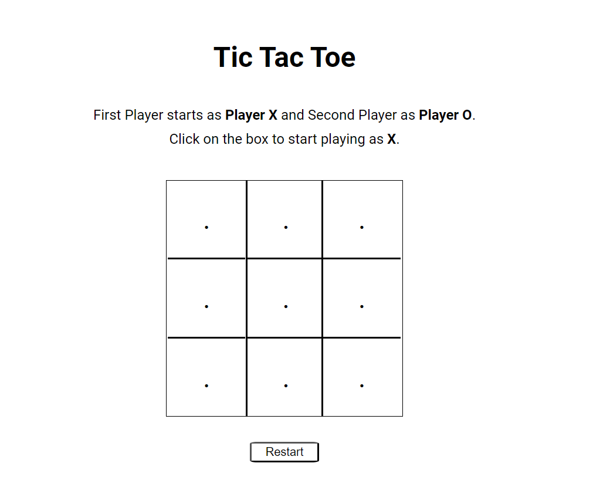
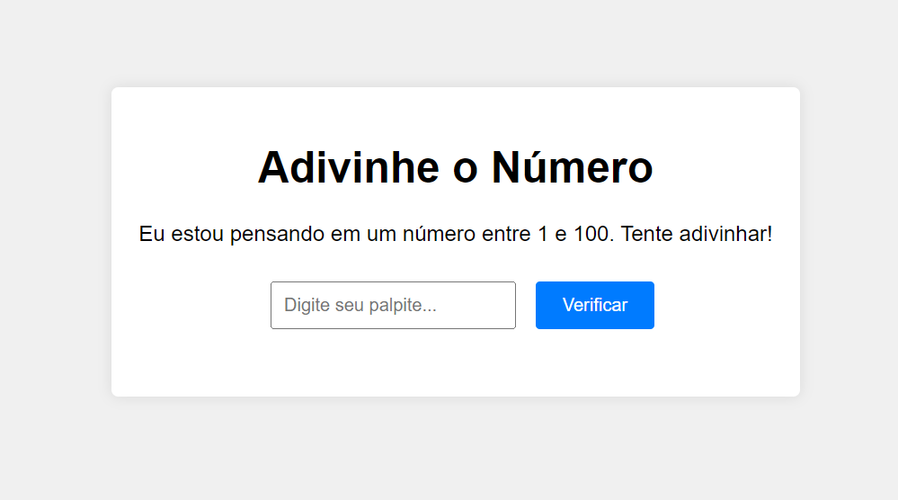
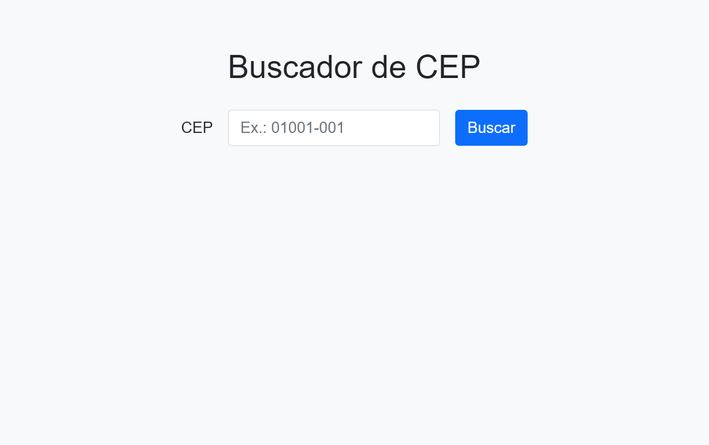

# learning-web-projects
Projetos simples criados durante os estudos na Magna/AlmavivA Solutions para praticar web e Git.

## 🕹️ Acesse e jogue!
- [Tic Tac Toe](https://ssb-11.github.io/learning-web-projects/tictactoe/): o clássico jogo da velha, para jogar em dupla!
  - **Status**: melhorias em andamento.   

- [Adivinhe o número](https://ssb-11.github.io/learning-web-projects/jogo-adivinhacao/): um jogo simples que consiste na adivinhação de um número gerado aleatóriamente.
  - **Status**: concluído.   

## 🛠️ Ferramentas
- [Buscador de CEP](https://ssb-11.github.io/learning-web-projects/buscador-cep/): um buscador de CEP simples, que retorna informações como nome da rua, cidade e estado.

  - **Status**: concluído.   
